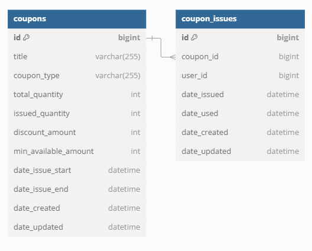

# 개요


[패스트캠퍼스의 대용량 트래픽 강의](https://fastcampus.co.kr/dev_online_traffic_data) 에서 선착순 쿠폰 발급 섹션을 학습하기 위한 프로젝트다.

한정된 수량의 선착순 쿠폰을 발급하는 기능을 개발한다. 짧은 시간에 많은 트래픽이 몰리는 상황에 대처하기 위해 쿠폰 요청과 쿠폰 발급을 별도의 서비스로 구분해서 이벤트 기반의 비동기로 처리한다.

강의에서는 멀티 모듈로 진행하는데 이 프로젝트는 싱글 모듈로 진행한다.


<br>

# ERD



<br>

# 엔티티

Coupon

```java
@Entity
@Table(name = "coupons")
public class Coupon extends BaseTimeEntity {

    @Id
    @GeneratedValue(strategy = GenerationType.IDENTITY)
    private Long id;

    @Column(nullable = false)
    private String title;

    @Column(nullable = false)
    @Enumerated(value = EnumType.STRING)
    private CouponType couponType;

    @Column()
    private Integer totalQuantity;

    @Column(nullable = false)
    private int issuedQuantity;

    @Column(nullable = false)
    private int discountAmount;

    @Column(nullable = false)
    private int minAvailableAmount;

    @Column(nullable = false)
    private LocalDateTime dateIssueStart;

    @Column(nullable = false)
    private LocalDateTime dateIssueEnd;
}
```

<br>

CouponIssue

```java
@Entity
@Table(name = "coupon_issues")
public class CouponIssue extends BaseTimeEntity {

    @Id
    @GeneratedValue(strategy = GenerationType.IDENTITY)
    private Long id;

    @Column(nullable = false)
    private Long couponId;

    @Column(nullable = false)
    private Long userId;

    @Column(nullable = false)
    @CreatedDate
    private LocalDateTime dateIssued;

    @Column()
    private LocalDateTime dateUsed;
}
```

<br>

BaseTimeEntity

```java
@MappedSuperclass
public class BaseTimeEntity {

    @CreatedDate
    private LocalDateTime dateCreated;

    @LastModifiedDate
    private LocalDateTime dateUpdated;
}
```

<br>

CouponType

```java
public enum CouponType {
    FIRST_COME_FIRST_SERVED // 선착순 쿠폰
}
```

<br>

# 트래픽 처리

## 동기

```
클라이언트 -> API -> DB
```

클라이언트에서 API 로 요청을 보내고, API 에서는 DB 에 트랜잭션 요청하는 구조다.

쿠폰 조회와 쿠폰 발급을 동기적으로 처리한다. 많은 트래픽이 몰릴 경우 동시성 이슈가 발생할 수 있다.

로드 밸런서로 API 를 scale out 한다고 해도 처리량이 늘어나긴 어렵다. 결국 하나의 DB 로 트랜잭션 요청이 가기 때문에 DB 가 병목지점이라 API 를 scale out 하는게 DB 의 처리량을 올리는 것과 상관이 없다. 오히려 DB 로 더 많은 요청이 가면서 DB 의 병목이 더 심해질 수 있다.

DB 에 병목이 생기면 읽기 작업을 캐시를 둘 수 있다. 예를 들어, Redis 를 두고 읽기 작업은 Redis 에 캐시한 다음 Redis 로 트래픽을 보내면 처리량이 올라갈 수 있다. DB 에 조회하는 트래픽이 낮아지면서 DB 의 부하가 낮아진다. 혹은 DB 의 서버를 확장하거나 샤딩 등을 이용하는 방법도 있다.

<br>

## Lock (synchronized)

### 트랜잭션 하위에서 Lock 획득 및 반납

```
실행 순서
1. 트랜잭션 시작
2. Lock 획득
3. 쿠폰 발급
4. Lock 반납
5. 트랜잭션 커밋
```

Java 에서 제공하는 synchronized 메소드를 통해 Lock 을 사용한다. 쿠폰 조회와 쿠폰 발급 과정을 Lock 안에서 실행한다. 트랜잭션을 시작하고 Lock 을 획득하기 때문에 동시성 이슈가 발생할 수 있다. 

한 스레드가 Lock 을 반납하고 트랜잭션 커밋을 하기 전에 다른 스레드가 Lock 을 획득해서 쿠폰 수량을 조회할 수 있다. 쿠폰 수량이 변경되기 전의 값이 DB 에서 조회되면서 쿠폰이 발급된 수량(Coupon 엔티티의 issuedQuantity)과 실제 발급한 쿠폰(CouponIssue 엔티티의 갯수)이 일치하지 않는다.

<br>

### 트랜잭션 상위에서 Lock 획득 및 반납

```
실행 순서
1. Lock 획득
2. 트랜잭션 시작
3. 쿠폰 발급
4. 트랜잭션 커밋
5. Lock 반납
```

트랜잭션을 시작하기 전에 먼저 Lock 을 획득하고 트랜잭션을 커밋한 이후에 Lock 을 반납한다.

앞선 상황에서 발생하는 동시성 이슈는 해결할 수 있으나 이는 어디까지나 단일 서버에서 실행될 경우만 해당한다. 만약에 운영하는 서버가 2대 이상일 경우 동시성 이슈가 여전히 발생할 수 있다.

synchronized 메소드는 현재 실행하고 있는 서버 안에서만 Lock 을 걸 수 있어서 다른 서버와는 관계가 없다.

<br>

## Redis 분산락 (Redisson)

Java 의 synchronized 대신 [Redis 의 분산락](https://redis.io/docs/latest/develop/use/patterns/distributed-locks/)을 이용한다. Redis 분산락은 여러 구현체들이 있고 이 중 Redisson 을 사용한다. [Redisson 실무 사용 사례](https://helloworld.kurly.com/blog/distributed-redisson-lock/)가 분산락을 이해하는데 많은 도움이 됐다.

이 프로젝트는 단일 서버로 실행하기 때문에 분산락이 필요한 환경이라고 보긴 어렵지만 다중 서버 환경에서 분산락을 사용해서 동시성 이슈를 해결하는데 도움이 된다는 점을 배울 수 있었다.

<br>

## DB exclusive lock

Redis 가 아닌 DB(MySQL) 의 Lock 을 사용한다. JPA 에서 제공하는 비관적 락으로 구현한다. 비관적 락을 사용하면 한 트랜잭션에서 Select 하는 row 가 모두 X-Lock 이 걸려서 다른 트랜잭션은 해당 row 에 접근할 수 없다.

<br>

## 비동기

유저 트래픽과 쿠폰발급 트랜잭션을 분리해서 비동기로 쿠폰발급을 처리한다.

유저 트래픽은 Redis, 쿠폰발급 트랜잭션은 DB(MySQL) 로 처리한다.

Redis 에서 사용할 자료구조는 Set 이다. Sorted Set 대신 Set 을 사용한다. 선착순 쿠폰이기 때문에 전체 수량을 제어하는게 중요하다. 첫번째 순서와 마지막 순서의 차이가 없다.

<br>

### Sorted Set vs Set

Sorted Set 과 Set 모두 특정 key 에 대한 value 의 중복을 허용하지 않는다. 반면에 Sorted Set 은 Set 과 달리 추가 인자로 넣는 score 에 따라 정렬을 유지할 수 있다.

Sorted Set 에서 값을 추가하는 메서드(ZADD)의 [시간 복잡도는 O(logN)](https://redis.io/docs/latest/develop/data-types/sorted-sets/) 이고 Set 에서 값을 추가하는 메서드(SADD)의 [시간 복잡도는 O(1)](https://redis.io/docs/latest/develop/data-types/sets/) 이다. 

ZADD 는 값이 이미 존재할 경우 덮어쓰고 SADD 는 값이 이미 존재할 경우 덮어쓰지 않고 무시한다.

Spring 에서 제공하는 Redis 의 Sorted Set (ZSet) 연산 구현체인 DefaultZSetOperations 클래스의 addIfAbsent 메소드를 이용하면 값이 존재하지 않는 경우만 Sorted Set 에 값을 추가할 수 있다.

이 프로젝트에서 Sorted Set 과 Set 둘 다 사용 가능한데 최종적으로는 Set 을 사용한다. 

첫번째 이유는 선착순 쿠폰의 경우 선착순 여부가 중요하지 선착순 대상의 순서가 중요하지 않기 때문이다. 예를 들어, 선착순으로 100개의 쿠폰을 발행한다고 할때 1등부터 100등까지는 동일한 쿠폰을 받고 등수에 따른 차이가 없다.

또 다른 이유는 ZADD 보다 SADD 의 성능이 더 빠르기 때문이다. ZADD 의 시간 복잡도는 O(logN) 인 반면 SADD 의 시간 복잡도는 O(1) 이다. 

선착순 여부만 판단하면 되기 때문에 굳이 선착순 대상의 정렬 순서를 유지하는 ZADD 를 사용할 이유가 없다. 

게다가 ZADD 의 경우 값이 있는 경우 덮어쓴다고 했는데 한 유저가 선착순 신청을 여러번 했다고 할 때 마지막 요청이 아닌 첫번째 요청으로 접수되는게 자연스럽다. 덮어써서 마지막 요청으로 접수되는건 바람직하지 않다.

덮어쓰지 않기 위해 값이 존재하지 않는 경우만 Sorted Set 에 추가하는 addIfAbsent 메소드를 사용할 수 있는데 addIfAbsent 메소드도 내부적으로는 결국 ZADD 를 호출한다. SADD 보다 성능 면에서 떨어지기 때문에 SADD 를 사용하는게 낫다.

<br>

### Redis 분산락

```
분산락 안에서 진행되는 로직
1. 쿠폰 발급 수량 제어
2. 중복 발급 요청 제어
3. 쿠폰 발급 요청 저장
4. 쿠폰 발급 큐 적재
```

동시성 이슈를 해결하기 위해 분산락을 사용한다.

레디스가 싱글 스레드로 동작하지만 단일 연산이라면 분산락 없이 동시성 이슈가 발생하지 않았겠지만 여러 연산이 수행되기 때문에 싱글 스레드라고 하더라도 동시성 이슈가 발생할 수 있다. 1, 2, 3, 4 로직 전체가 하나의 쿠폰 발급인데 1, 2, 3, 4는 원자적으로 실행되지 않는다. 

위의 1, 2 연산에서 정합성을 검증하고 3, 4 연산에서 쿠폰 발급을 처리한다. 특정 스레드의 1, 2 연산과 3, 4 연산 사이에 다른 여러 스레드들이 1, 2 연산을 수행할 수 있다. 1, 2 연산은 모두 통과하면서 3, 4 연산도 문제없이 실행되고 쿠폰 수량과 쿠폰 발급 간의 정합성이 깨지면서 동시성 이슈가 발생하게 된다.

<br>

### Redis Script

Redis 분산락 대신 성능 향상을 위해 Redis Script 를 사용한다. Redis Script 를 통해 4개 작업을 원자성을 가진 1개 작업으로 전환한다.

<br>

### 캐시

매번 DB 에서 쿠폰 정보를 조회하지 않도록 캐시를 이용한다. Redis 캐시와 로컬 캐시를 사용한다.

최초 쿠폰 요청때 Redis 와 로컬 캐시에 등록되고 (발급 가능한) 마지막 쿠폰 요청까지는 캐시가 업데이트 되지 않는다. 

특정 쿠폰에 대한 쿠폰 요청이 총 발급 가능한 수량 이상이거나 쿠폰의 유효 시기가 아닌데 발생할 경우 Redis 와 로컬 캐시를 모두 업데이트 한다.

캐시에서 조회한 쿠폰 정보는 쿠폰이 발급 가능한 상태로 유지되다가 발급 가능한 쿠폰 수량을 채우면 업데이트 된다. 이때부터는 캐시에서 조회한 쿠폰 정보는 쿠폰 발급이 불가능한 상태를 나타낸다.

<br>

# 부하 테스트

locust 로 부하 테스트를 실행한다.

<br>

## 동기

동시성 이슈가 발생한다. coupons 테이블의 issued_quantity 494 로 500 개가 채워지지 않았으나, 실제로 발급된 coupon_issues 테이블의 row 수는 4924 로 500개로 제한된 쿠폰 발급량 보다 거의 10배 많은 쿠폰 발급이 발생했다. 

<br>

## Lock (synchronized)

### 트랜잭션 하위에서 Lock 획득 및 반납

```
실행 순서
1. 트랜잭션 시작
2. Lock 획득
3. 쿠폰 발급
4. Lock 반납
5. 트랜잭션 커밋
```

트랜잭션을 시작한 후에 Lock 을 획득하는 순서로 진행했다. 이때는 여전히 동시성 이슈가 발생한다. 

스레드 A가 Lock 을 반납(실행순서 4)하고 트랜잭션을 커밋(실행순서 5)하기 전에 스레드 B가 트랜잭션을 시작(실행순서 1)할 수 있다. 스레드 A의 트랜잭션이 커밋되지 않아서 아직 DB에는 쿠폰 수량이 1 증가하지 않았다. 스레드 B는 쿠폰 수량을 조회하면 쿠폰 수량이 1 증가하기 이전의 쿠폰 수량 값이 조회된다.

<br>

### 트랜잭션 상위에서 Lock 획득 및 반납

```
실행 순서
1. Lock 획득
2. 트랜잭션 시작
3. 쿠폰 발급
4. 트랜잭션 커밋
5. Lock 반납
```

트랜잭션을 시작하기 전에 Lock 을 획득하는 순서로 진행했다. 이때는 동시성 이슈가 발생하지 않는다.

Lock 을 획득하지 못하면 트랜잭션을 시작할 수 없다. Lock 을 획득한 하나의 스레드가 쿠폰 발급을 마치고 트랜잭션을 커밋을 끝낸 뒤 Lock 을 반납할 때까지 다른 스레드는 Lock 을 획득할 수 없어서 쿠폰 발급을 할 수 없다.

<br>

### Redis 분산락 (Redisson)


<br>

### DB exclusive lock


<br>

### 비동기 - sorted set


<br>

### 비동기 - set


<br>

# 설정 에러 및 해결

## docker

### docker 명령어

- docker-compose.yml 실행

```
docker-compose up -d
```

<br>

- docker-compose.yml 을 구동할 worker 를 3개로 설정

```
docker-compose up -d --scale worker=3
```

<br>

### docker 에서 mysql 연결

- [mysql port 변경 방법](https://infinitecode.tistory.com/49)

```
// my.cnf
port=3308
```

<br>

- [Public key retrieval is not allowed 에러](https://deeplify.dev/database/troubleshoot/public-key-retrieval-is-not-allowed)

```
드라이버의 속성에서 allowPublickeyRetrieval 을 true 로 변경해야 한다
```

<br>

- [터미널로 port 변경방법 확인](https://seongeun-it.tistory.com/317)

```

```

<br>

- 계정 관련 에러

```
Access denied for user 'abcd'@'%' to database 'coupon-1'
```

port 변경 후 접근 에러 발생가 발생했다. docker-compose 를 이용하고 있었는데 volume 을 삭제하고 다시 실행시켜서 해결했다.

<br>

## Python

- 인터프리터 에러

```
No Python interpreter configured for the module
```

file - project structure 의 SDKs 에서 Python SDK 를 System Interpreter 로 설정한 뒤, file - project structure 의 Modules 에서 + 를 눌러서 Python 을 추가했다. load-test 폴더가 위치한 곳은 main, test 폴더 내부가 아니라 최상단 경로라 main, test 와 나란한 경로에 추가했다.

<br>

<참고>

https://fastcampus.co.kr/dev_online_traffic_data

https://dbdiagram.io/home

https://redis.io/docs/latest/develop/use/patterns/distributed-locks/

https://helloworld.kurly.com/blog/distributed-redisson-lock/


https://infinitecode.tistory.com/49

https://deeplify.dev/database/troubleshoot/public-key-retrieval-is-not-allowed

https://seongeun-it.tistory.com/317

https://velog.io/@ppinkypeach/Docker-Compose%EB%A1%9C-Mysql-%EC%8B%A4%ED%96%89-%EC%8B%9CAccess-denied-for-user-rootlocalhost-using-passwordYES-%ED%95%B4%EA%B2%B0

https://kdh0518.tistory.com/entry/Docker-ERROR-1045-28000-Access-denied-for-user-rootlocalhost-%ED%95%B4%EA%B2%B0-%EB%B0%A9%EB%B2%95-%EC%B4%9D-%EC%A0%95%EB%A6%AC

https://jojoldu.tistory.com/547

https://ddururiiiiiii.tistory.com/351

https://jojoldu.tistory.com/465

https://dbdiagram.io/

https://www.youtube.com/watch?v=MTSn93rNPPE

https://redis.io/docs/latest/develop/data-types/sorted-sets/

https://redis.io/docs/latest/develop/data-types/sets/

https://charsyam.wordpress.com/2020/05/05/%EC%9E%85-%EA%B0%9C%EB%B0%9C-redis-6-0-threadedio%EB%A5%BC-%EC%95%8C%EC%95%84%EB%B3%B4%EC%9E%90/

